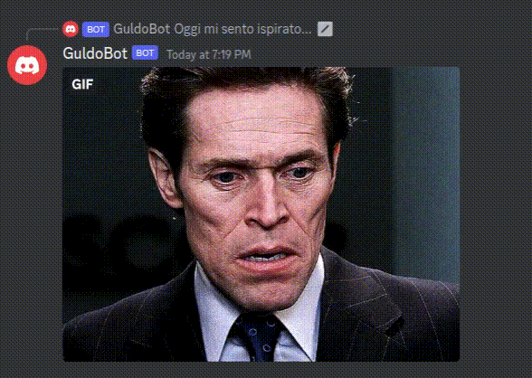

# Guldo Bot

The first funny discord bot to play a list of selected gifs as if it was a radio channel.

</img>

## The channels

Each channel has a different list of gifs and video that you can watch while you are on discords.

The duration of the channel is different and generally depends on the number of gifs available. 

Feel free to change/add/remove gifs in the channels dictionary at `/gifs`


> [ ! IMPORTANT ]
> I strongly suggest you to combine this bot with a Music Player Bot so you can listen to the music and watch the gifs at the same time for an incredible experience 

### /buongiorno 

</img>

```
/buongiorno
```

Perfect to play a list of goodmorning gifs full of beautiful women and with incredible landscapes.

I suggest you to play some chilling music with this channel ;)

<b>Keywords: Morning coffee, have a good day </b> 


## /midnightmovie 

</img>

```
/midnightmovie-guldo 
```

Thats for sure the channel that you must play when its midnight and you want to smoke the last before you are going to bed...if you will ever be able to do after listening to this channel.

<b>Keywords: Art, Midnight movies </b> 

## /jailnight 

</img>

```
/jailnight-guldo 
```

What happens when a thief falls in love with a police girl ? Well, he starts to listen to `/jailnight-guldo`!

This channel is for all bad boys that dream to ride a bike in the desert looking for redemption to conquer their lady that, unfortunately, she is a cop!

<b>Keywords: Police, Thieves</b>


---

### Coming soon

Beware that much more channels are coming soon. 

`Do you want a taste of this new channels?`

Well, what about the **80s** and **classic love songs**. Prepare yourself that other surprise are coming soon!


---
## Installation

Just simple as always:

```
make build
```

And to run locally the bot:

```
make start
```

---


# License and Notes


>Just a simple bot, maybe funny but nothing serius. Me and my friends were very happy to play with this bot during the quarantine.

>Guldo comes from the famous DragonBall Z enemy. Anyway I think that William Defoe in Spiderman is a much better representation of this funny bot.


